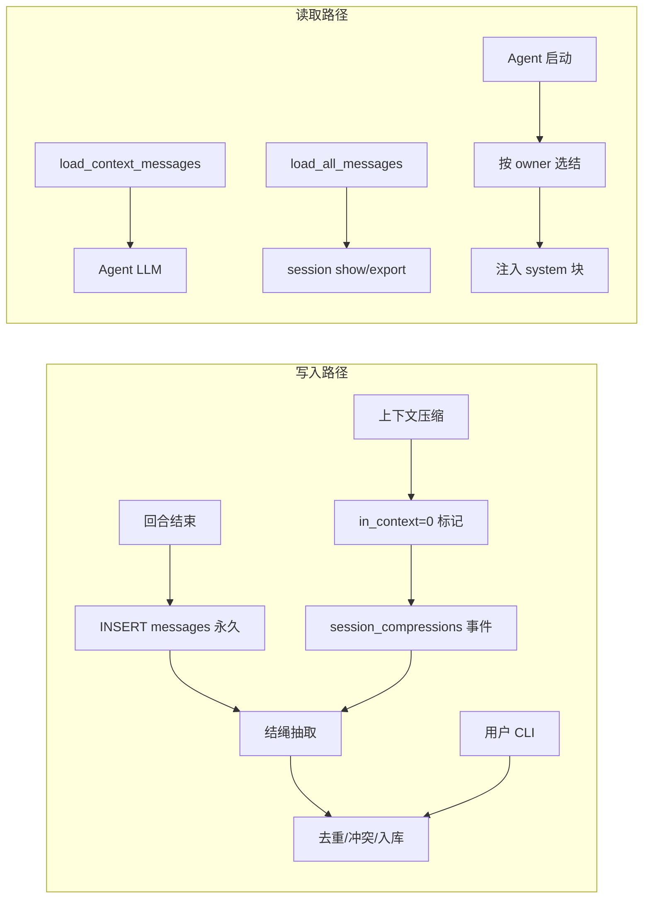

# 结绳记事：hi 长期记忆详细设计

> **状态**：proposed（M7 实施方案）  
> **作者**：gz  
> **日期**：2026-06-04  
> **关联**：[m7-memory-system.md](../exec-plans/active/m7-memory-system.md)、[core-beliefs.md](../design-docs/core-beliefs.md)

## 1. 概述

### 1.1 背景

hi 是个人 AI 助手（本地 TUI + 消息渠道 Gateway）。当前持久化仅有 **会话 transcript**（`messages` 表）与 M5 的 **有损压缩**（LLM 摘要 + `replace_messages` 删除原文）。这对「跨天、跨会话仍记得住用户是谁、偏好什么、做过什么决定」不够用。

### 1.2 目标

建设 **结绳记事（Knot Memory）** 作为 hi 的**长期记忆层**：

| 目标 | 说明 |
|------|------|
| 跨会话长期记忆 | 重启、`tui` / `chat` 切换后仍能注入关键事实与偏好 |
| **会话永久保留** | 每条 message **只追加、不删除**；压缩仅改变「是否进入 LLM 上下文」，原文永远在库 |
| 可审计 | 每条记忆可溯源到 message id 范围；用户可 export 完整 transcript |
| 轻量 | 默认 SQLite + 类型 + 关键词，**不依赖向量库** |
| 与 transcript 分离 | 会话原文仍按渠道隔离；长期记忆按 **owner** 聚合（个人助手默认单用户） |
| 可遗忘 | clarity 衰减；用户可主动强化或删除 |

### 1.3 非目标（M7 首版）

- 不做托管 Memory SaaS、不做多租户
- 不替换 session transcript 隔离模型
- 不要求首版就上 embedding / 向量检索（预留扩展点）
- 不做知识图谱、多跳推理
- 不做 MCP / 外部记忆服务

### 1.4 设计隐喻（实现映射）

| 隐喻 | 实现职责 |
|------|----------|
| **结绳** | `knots` 表：一条记忆 = 一个结 = 一句 typed 原子 |
| **弥米尔之首** | `session_compressions` 表：压缩事件日志，指向 messages id 范围（原文不搬移） |
| **忘川** | `clarity` 衰减 + `permanent` 标记；低于阈值不注入 |
| **竹简** | `messages` 表 append-only：会话全文永久留存，`in_context` 标记是否进入当前上下文 |

---

## 2. 设计原则

1. **Transcript 与 Memory 分离**  
   - Transcript：当前会话「发生了什么」（按 `session_id` 隔离，遵守 core-beliefs）。  
   - Knot：提炼后的「值得长期记住什么」（按 `owner_id` 共享，服务个人助手）。

2. **一个结一件事**  
   - 每条 knot 是一句可独立理解的原子陈述（建议 ≤ 200 字）。  
   - 禁止把整段摘要塞进一条 knot。

3. **写入慢、读取快**  
   - 抽取在**回合结束**或**压缩仪式**时异步/批量完成（一次 LLM structured 调用）。  
   - 注入时只做 SQL 查询 + 字符串拼接，不占主路径延迟。

4. **默认本地、默认透明**  
   - 数据在 `~/.hi/data/sessions.db`（与现有 store 同库，新表）。  
   - `hi memory list` 可查看；敏感 knot 支持 `visibility = private`（仅 CLI 可见，不注入 LLM）。

5. **hi-core 平台无关**  
   - 记忆逻辑在 `hi-core::store` / `hi-core::memory`；CLI 在 `app/`；TUI 仅订阅事件。

6. **会话永久保留（硬约束）**  
   - `messages` **append-only**：禁止 `DELETE FROM messages`（压缩、迁移、工具路径均不得删行）。  
   - 「压缩」= 将旧消息标记为 `in_context = 0` + 内存中裁剪 LLM 视图；**库中全文可恢复、可 export**。  
   - `sessions` 记录不自动过期；仅 `hi session purge`（显式确认）可物理清理。

---

## 3. 作用域：个人助手的 owner 模型

### 3.1 问题

当前 `SessionStore::get_or_create_session` 将 `user_id = session_id`（如 `chat:main` 与 `tui:main` 是不同 user）。**Transcript 应保持隔离**，但个人助手的长期记忆应跨本地入口共享。

### 3.2 决策：引入 `OwnerId`

```rust
/// 记忆归属：一个「人」或「使用 hi 的实体」
pub struct OwnerId(pub String);
```

| 场景 | `owner_id` 默认值 | 说明 |
|------|-------------------|------|
| 本地 TUI / chat | `local` | 配置项 `[memory].owner_id`，默认 `local` |
| 企微 DM `wecom:{userid}` | `wecom:{userid}` | 远程联系人各自独立记忆（非 owner 本人） |
| 未来：绑定同一 owner | `channel_identities` 映射 | 可将企微 userid 映射到 `local`（M7+ 可选） |

**Knot 作用域**：

```rust
enum KnotScope {
    /// 默认：该 owner 下所有会话共享（个人助手长期记忆）
    Owner,
    /// 可选：仅某 session 有效（如「这次调试只在这个项目目录」）
    Session(SessionId),
}
```

首版实现：**仅 `Owner` scope**；`Session` scope 预留字段，不实现检索逻辑。

### 3.3 与 core-beliefs 的关系

- ✅ **不违背**「会话按渠道隔离」：messages 仍按 `session_id` 读写。  
- ✅ **补充**：knots 是独立层， deliberately 跨 `tui:main` / `chat:main` 共享（同一 `owner_id = local`）。  
- ✅ **补充**：各渠道 **transcript 永久保留**于 `messages`；隔离指「默认不互相加载上下文」，不是「互相删数据」。

---

## 4. 会话永久保留（Append-only Transcript）

> 个人助手的一言一语都是资产。M5 的 `replace_messages`（DELETE 全表再 INSERT）**必须废止**。

### 4.1 两层视图

| 视图 | 存储 | Agent 是否加载 | 用户 CLI |
|------|------|----------------|----------|
| **全文（竹简）** | `messages` 全部行 | 否 | `hi session show`、`hi session export` |
| **上下文（活记忆）** | `messages WHERE in_context = 1` | 是 | `hi session show --context` |

```text
messages 表（示意）

 id │ session_id │ role      │ content        │ in_context
────┼────────────┼───────────┼────────────────┼───────────
  1 │ chat:main  │ system    │ You are hi...  │ 1
  2 │ chat:main  │ user      │ 旧对话 turn 1   │ 0   ← 已压缩出上下文，仍在库
  3 │ chat:main  │ assistant │ ...            │ 0
 ...
 42 │ chat:main  │ user      │ 最近一轮        │ 1
 43 │ chat:main  │ assistant │ ...            │ 1
```

### 4.2 硬规则

| 操作 | 允许 | 禁止 |
|------|------|------|
| 新回合写入 | `INSERT` messages | — |
| 压缩 | `UPDATE messages SET in_context = 0 WHERE id IN (...)` | `DELETE` |
| 加载 Agent 历史 | `SELECT ... WHERE in_context = 1` | 加载后删库 |
| workdir 变更 | `UPDATE` system 行 content | `replace_messages` 删全表 |
| 用户清理 | `hi session purge`（二次确认） | 静默 GC |

### 4.3 `replace_messages` 归宿

| 现状调用方 | M7 改造 |
|------------|---------|
| `compress_if_needed` → 删 middle | **删除此路径**；改为 `mark_out_of_context` + 内存裁剪 |
| `sync_history_workdir` 更新 system | **`update_system_message(session_id, content)`** 单行 UPDATE |
| 测试 `replace_messages_is_atomic` | 改为测试 `mark_out_of_context` 事务性 |

`SessionStore::replace_messages` 标记 **`#[deprecated]`**，M7 后仅测试/迁移脚本可用，生产路径不得调用。

### 4.4 压缩事件表（替代「搬 JSON 的 archives」）

原文已在 `messages`，压缩事件只记录 **元数据 + message id 范围**，不重复存 transcript：

```sql
CREATE TABLE IF NOT EXISTS session_compressions (
    id INTEGER PRIMARY KEY AUTOINCREMENT,
    session_id TEXT NOT NULL REFERENCES sessions(id),
    message_id_from INTEGER NOT NULL REFERENCES messages(id),
    message_id_to INTEGER NOT NULL REFERENCES messages(id),
    message_count INTEGER NOT NULL,
    token_estimate INTEGER,
    summary_text TEXT,              -- 可选，供人读；不注入 LLM 时可为空
    knots_extracted INTEGER NOT NULL DEFAULT 0,
    created_at INTEGER NOT NULL
);
CREATE INDEX IF NOT EXISTS idx_session_compressions_session
    ON session_compressions(session_id, created_at DESC);
```

**重建全文**（无需 JSON 副本）：

```sql
SELECT role, content, tool_call_id, tool_calls_json, reasoning_content, created_at
FROM messages
WHERE session_id = ? AND id BETWEEN ? AND ?
ORDER BY id ASC;
```

`knot_provenance` 改为引用 `session_compressions.id` 与 `message_id_from..to`。

### 4.5 sessions 表扩展

```sql
ALTER TABLE sessions ADD COLUMN message_count INTEGER NOT NULL DEFAULT 0;  -- 冗余计数，便于 list
ALTER TABLE sessions ADD COLUMN last_compression_at INTEGER;
-- 不添加 TTL；sessions 永久保留直至用户 purge
```

### 4.6 存储与体量

个人助手预期：单 session 数万条 message、数百 MB 级 SQLite **可接受**（WAL 已启用）。

| 策略 | 说明 |
|------|------|
| 默认 | 不裁剪、不 TTL |
| 可选 `[memory].session_purge_enabled` | 默认 `false`；仅 CLI 手动 purge |
| 未来 M7+ | `hi session vacuum` 仅 REINDEX/清理已 purge 的空洞，不自动删旧会话 |

---

## 5. 结的类型（KnotKind）

首版 **5 类**，对齐个人助手高频场景，避免分类过细（如十几类）的过度设计：

| Kind | 含义 | 示例 | 注入优先级 |
|------|------|------|------------|
| `preference` | 稳定偏好 | 「回复使用简体中文」 | 高 |
| `fact` | 关于用户/环境的客观事实 | 「主要开发语言是 Rust」 | 高 |
| `decision` | 已做出的选择 | 「M7 先做 archive 再做 knot 抽取」 | 中 |
| `task` | 未完成待办 | 「待写 knot 抽取单元测试」 | 中（未完成优先） |
| `procedure` | 可复用流程 | 「发布前跑 cargo test -p architecture-tests」 | 低 |

**任务结**在 `status = open` 时提高排序权重；`done` / `cancelled` 后 clarity 快速衰减或归档。

---

## 6. 数据模型

### 6.1 ER 关系

```text
memory_owners (1) ──< knots (N)
sessions (1) ──< messages (N)          ← append-only，永久保留
sessions (1) ──< session_compressions (N)  ← 压缩事件，指向 message id 范围
session_compressions (1) ──< knot_provenance (N) >── (1) knots
messages (1) ──< knot_provenance (N)   ← 可选：精确到 source message id
```

### 6.2 表结构（SQLite）

#### `messages`

```sql
CREATE TABLE IF NOT EXISTS messages (
    ...
    in_context INTEGER NOT NULL DEFAULT 1,
    ...
);
```

**约束**：生产代码不得 `DELETE FROM messages`（仅 `hi session purge` 且用户 `--confirm`）。

#### `memory_owners`

```sql
CREATE TABLE IF NOT EXISTS memory_owners (
    id TEXT PRIMARY KEY,           -- e.g. 'local', 'wecom:zhangsan'
    display_name TEXT,
    created_at INTEGER NOT NULL
);
```

#### `knots`

```sql
CREATE TABLE IF NOT EXISTS knots (
    id INTEGER PRIMARY KEY AUTOINCREMENT,
    owner_id TEXT NOT NULL REFERENCES memory_owners(id),
    scope TEXT NOT NULL DEFAULT 'owner',  -- 'owner' | 'session'
    session_id TEXT,                      -- scope=session 时必填
    kind TEXT NOT NULL,                   -- preference|fact|decision|task|procedure
    content TEXT NOT NULL,                -- 一句原子陈述
    status TEXT NOT NULL DEFAULT 'active', -- active|superseded|deleted
    task_status TEXT,                     -- open|done|cancelled（kind=task）
    confidence TEXT NOT NULL DEFAULT 'inferred',  -- confirmed|inferred|dream
    clarity REAL NOT NULL DEFAULT 0.7,    -- 0.0~1.0，忘川
    permanent INTEGER NOT NULL DEFAULT 0, -- 1 = 不衰减
    visibility TEXT NOT NULL DEFAULT 'inject', -- inject|private
    content_hash TEXT NOT NULL,           -- 去重：normalize 后 sha256 前缀
    access_count INTEGER NOT NULL DEFAULT 0,
    last_accessed_at INTEGER,
    created_at INTEGER NOT NULL,
    updated_at INTEGER NOT NULL,
    superseded_by INTEGER REFERENCES knots(id)
);
CREATE INDEX IF NOT EXISTS idx_knots_owner_active
    ON knots(owner_id, status, kind) WHERE status = 'active';
CREATE INDEX IF NOT EXISTS idx_knots_owner_clarity
    ON knots(owner_id, clarity DESC) WHERE status = 'active';
```

#### `session_compressions`（弥米尔之首 · 压缩事件）

见 §4.4。不再使用存 `transcript_json` 的 `archives` 表（避免双份全文；**messages 即唯一事实来源**）。

#### `knot_events`（结绳变更日志，只追加）

```sql
CREATE TABLE IF NOT EXISTS knot_events (
    id INTEGER PRIMARY KEY AUTOINCREMENT,
    knot_id INTEGER REFERENCES knots(id),
    owner_id TEXT NOT NULL,
    event_type TEXT NOT NULL,  -- created|updated|superseded|reinforced|forgot|injected
    detail_json TEXT,
    source_session_id TEXT,
    source_compression_id INTEGER REFERENCES session_compressions(id),
    source_message_id_from INTEGER,
    source_message_id_to INTEGER,
    created_at INTEGER NOT NULL
);
```

#### `knot_provenance`

```sql
CREATE TABLE IF NOT EXISTS knot_provenance (
    knot_id INTEGER NOT NULL REFERENCES knots(id),
    compression_id INTEGER REFERENCES session_compressions(id),
    session_id TEXT NOT NULL,
    message_id_from INTEGER,
    message_id_to INTEGER,
    PRIMARY KEY (knot_id, compression_id)
);
```

### 6.3 Rust 类型（hi-core）

```rust
// core/src/memory/mod.rs

#[derive(Debug, Clone, Copy, PartialEq, Eq, Serialize, Deserialize)]
#[serde(rename_all = "snake_case")]
pub enum KnotKind {
    Preference,
    Fact,
    Decision,
    Task,
    Procedure,
}

#[derive(Debug, Clone, Copy, PartialEq, Eq, Serialize, Deserialize)]
#[serde(rename_all = "snake_case")]
pub enum KnotConfidence {
    Confirmed,  // 用户原话或 hi memory confirm
    Inferred,   // Agent 从对话推断
    Dream,      // 单次提及、弱信号
}

#[derive(Debug, Clone, Serialize, Deserialize)]
pub struct Knot {
    pub id: i64,
    pub owner_id: OwnerId,
    pub kind: KnotKind,
    pub content: String,
    pub confidence: KnotConfidence,
    pub clarity: f32,
    pub permanent: bool,
    pub task_status: Option<TaskStatus>,
    pub created_at: i64,
    pub updated_at: i64,
}
```

---

## 7. 生命周期

### 7.1 总览



### 7.2 结绳抽取（Knot Extraction）

**触发时机**：

1. 每轮 `TurnCompleted` 后（`[memory].extract_after_turn = true`）。默认
   `extract_after_turn_cue_only = true`：**无状态单回合判定**——仅当本回合命中
   记忆信号词（`turn_has_memory_cue`：记住 / 我叫 / 我喜欢 / remember …），或本回合
   新内容 token 估算 ≥ `extract_turn_min_tokens` 时才抽。设为 false 退回旧的「每轮无条件抽」。
   > 持久化模式下每回合会重建 `AgentLoop`，故此处不依赖跨回合计数；批量/必要性
   > 由压缩抽结承担。
2. `maybe_compress` 对 **in_context=1 的 middle 段**抽结（见 §8）；源文本来自 `messages` id 范围。  
3. Agent 主动调用 `memory_write` 工具（`memory_write_tool = true`）即时记录。  

**输入**：

- 自上次抽取以来的新 messages（`in_context=1` 或指定 id 范围）  
- 当前 owner 已有 active knots 列表（供 LLM 去重/更新，最多注入 50 条标题）

**LLM 调用**：单次 structured output（JSON array），system prompt 要求：

- 只输出 **新增或需更新** 的结  
- 每条：`kind`, `content`, `confidence`, `supersedes_content_hash?`  
- 不输出已在列表中且未变化的结  
- `Dream` 仅用于弱信号；用户明确说「记住」→ `Confirmed`

**示例输出**：

```json
[
  {
    "kind": "preference",
    "content": "用户希望文档与回复使用简体中文",
    "confidence": "confirmed"
  },
  {
    "kind": "task",
    "content": "完成结绳记事的 M7 详细设计",
    "confidence": "inferred",
    "task_status": "open"
  }
]
```

**入库规则**：

| 情况 | 动作 |
|------|------|
| `content_hash` 与已有 active 结相同 | 跳过；`access_count++` |
| 新 content 与旧结语义冲突（同 kind 领域） | 旧结 `status=superseded`，新结 `superseded_by` 链 |
| `confidence = dream` 且 clarity 初始 0.4 | 不注入，除非用户 reinforce |
| 用户 `hi memory add` | 直接 `Confirmed` + `permanent` 可选 |

### 7.3 检索与注入（Recall & Inject）

**时机**：`AgentLoop` 构建 system message 时（`sync_history_workdir` 之后）。

**算法**（无向量首版）：

```text
1. SELECT active knots WHERE owner_id = ? AND status = 'active'
2. 过滤 clarity >= inject_threshold (默认 0.35)
3. 过滤 confidence != dream OR clarity >= 0.6
4. 过滤 visibility = 'inject'
5. 若用户消息非空：content LIKE 关键词 OR kind IN (preference, fact) 全量保留
6. 排序：permanent DESC, kind 权重, task open 优先, clarity DESC, updated_at DESC
7. 截断：总字符 ≤ max_inject_chars (默认 2000)
8. 格式化为 system 附加块（见 §7.4）
```

**关键词**：从当前 user message 提取（简单：CJK 2+ 字、英文 3+ 字母）；无 user message 时（启动）注入全部高优先级结。

**强化**：注入过的 knot `clarity = min(1.0, clarity + 0.15)`，`access_count++`，写 `knot_events`。

### 7.4 注入格式

追加在 system prompt 末尾（`Working directory` 之后）：

```text
## 长期记忆（结绳）

以下为你对该用户的长期记忆。若与当前对话冲突，以当前对话为准；不确定时请询问用户。

【偏好】
- 回复使用简体中文（已确认）

【事实】
- 主要维护 hi 个人助手项目，Rust workspace（推断）

【待办】
- [ ] 实现 knot 抽取单元测试（推断）

【决定】
- M7 记忆采用结绳 + 会话永久保留，压缩只改 in_context（已确认）
```

`dream` 置信度的结 **不注入**；CLI `hi memory list --all` 可见。

### 7.5 忘川：clarity 衰减

**配置**：

```toml
[memory]
decay_enabled = true
decay_half_life_days = 30      # 半衰期
inject_clarity_threshold = 0.35
```

**衰减公式**（每日 lazy 计算，在 read 或定时 touch 时）：

```text
clarity' = clarity * 0.5 ^ (days_since_last_access / half_life_days)
```

- `permanent = true`：跳过衰减  
- `clarity < 0.1`：自动 `status = superseded`（软删除，仍可通过 CLI 恢复）  
- `hi memory reinforce <id>`：`clarity = 1.0`, `permanent` 可选  
- `hi memory forget <id>`：`status = deleted`

### 7.6 冲突与 supersede

同 `owner_id` + 同 `kind` 下，若新结与旧结 **同一主题**（抽取 prompt 要求 LLM 填 `supersedes_id` 或 `supersedes_content`）：

1. 旧结 `status = superseded`, `superseded_by = new_id`  
2. 写 `knot_events`  
3. 保留旧结供审计，不注入

首版不做 embedding 相似度；依赖 LLM 抽取时的显式 supersede 字段。

---

## 8. 与上下文压缩集成

### 8.1 当前问题

`maybe_compress` → `replace_messages` → **`DELETE FROM messages`** → 原文永久丢失。与个人助手「会话永久保留」目标冲突。

### 8.2 新流程：压缩仪式（不删行）

```text
maybe_compress (改造):
  1. 从 DB 加载 in_context=1 的 messages（或与内存 history 对齐）
  2. 计算 split（与现逻辑相同）→ 得到 middle 的 message id 范围 [from, to]
  3. knot_extract(messages WHERE id BETWEEN from AND to)
  4. 可选 summary = llm_summarize(middle)  → 写入 session_compressions.summary_text（给人看）
  5. INSERT session_compressions(session_id, from, to, ...)
  6. UPDATE messages SET in_context = 0 WHERE session_id = ? AND id BETWEEN from AND to
  7. 内存 history ← system + knot_inject_block + recent_turns（不插摘要消息，见配置）
  8. 不调用 replace_messages；persisted_len 与 in_context 状态一致化
```

**关键**：步骤 6 之后，`hi session show` 仍能看到 from..to 全文；`hi session show --context` 与 Agent 一致。

### 8.3 Store API（新增/替换）

```rust
impl SessionStore {
    /// Agent 上下文：仅 in_context = 1
    pub fn load_context_messages(&self, session_id: &SessionId) -> Result<Vec<ChatMessage>>;

    /// 全文：永久保留的所有行
    pub fn load_all_messages(&self, session_id: &SessionId) -> Result<Vec<ChatMessage>>;

    /// 压缩：标记出上下文，写 compression 事件（事务内）
    pub fn mark_out_of_context(
        &self,
        session_id: &SessionId,
        message_id_from: i64,
        message_id_to: i64,
        compression: &NewSessionCompression,
    ) -> Result<i64>;  // returns compression id

    /// 更新 system 行（workdir 同步）
    pub fn update_system_message(&self, session_id: &SessionId, content: &str) -> Result<()>;

    /// @deprecated 禁止用于压缩；M7 后移除或仅 migration
    pub fn replace_messages(...) -> Result<()>;
}
```

### 8.4 配置

```toml
[context]
enabled = true
# 现有字段...

[memory]
inject_on_compress = true
compress_use_summary_fallback = false   # 不在 messages 表插 [Earlier summary] 伪 user 消息
retain_all_messages = true              # 硬编码 true，配置项仅作文档/测试开关
```

### 8.5 收益

- **会话永久保留**：messages 只增不减（purge 除外）  
- 压缩前后 message 总数不变，`in_context=0` 行可统计「已压缩字数」  
- `session_compressions` 提供压缩时间线，knot 可溯源到 id 范围  
- 长期事实进入 `knots`，跨 session 可用；LLM 上下文仍可控

### 8.6 恢复已压缩段进上下文（可选 M7+）

默认 **不恢复**（避免 token 爆炸）。CLI：

```sh
hi session uncompress --compression-id 3   # 将 from..to 设回 in_context=1，需警告 token
```

首版不实现；设计预留。

---

## 9. 配置（hi.toml）

```toml
[memory]
enabled = true
owner_id = "local"                 # 本地个人助手默认
extract_after_turn = true          # 启用「回合结束后抽取」路径
extract_after_turn_cue_only = true # 仅命中记忆信号或大体量回合才抽（无状态判定）
extract_turn_min_tokens = 200      # 本回合新内容达到该 token 量也触发（0=关）
extract_on_compress = true         # 压缩时对被裁剪段抽结（必要性兜底）
memory_write_tool = true           # 暴露 memory_write 工具供 Agent 主动记
max_inject_chars = 2000
inject_clarity_threshold = 0.35
decay_enabled = true
decay_half_life_days = 30
max_knots_per_owner = 500

# 会话保留（默认永久）
retain_all_messages = true             # 不得为 false 除非 fork 专用场景

# 预留，首版 false
vector_search_enabled = false
```

**Owner 解析**（runtime）：

```rust
fn resolve_owner(session_id: &SessionId, config: &MemoryConfig) -> OwnerId {
    if session_id.0.starts_with("wecom:") {
        OwnerId(session_id.0.clone())  // 远程用户独立
    } else {
        OwnerId(config.owner_id.clone())  // 本地共享 local
    }
}
```

---

## 10. CLI（app 层）

### 10.1 长期记忆

| 命令 | 说明 |
|------|------|
| `hi memory list` | 列出当前 owner active knots |
| `hi memory list --all` | 含 superseded / dream |
| `hi memory show <id>` | 详情 + provenance + events |
| `hi memory add "<text>" --kind fact --permanent` | 手动打结 |
| `hi memory forget <id>` | 软删 |
| `hi memory reinforce <id> [--permanent]` | 强化 clarity |
| `hi memory extract` | 对当前 session 手动触发抽取 |

### 10.2 会话（永久 transcript）

| 命令 | 说明 |
|------|------|
| `hi session list` | 所有 session（id、message 总数、in_context 数、最后活跃） |
| `hi session show [--session ID]` | **全文** transcript（默认） |
| `hi session show --context` | 仅 Agent 当前看见的 in_context=1 行 |
| `hi session compressions list [--session ID]` | 压缩事件时间线 |
| `hi session compressions show <id>` | 某次压缩的 id 范围 + summary + 关联 knots |
| `hi session export [--session ID] [-o file.json\|file.md]` | 导出全文 |
| `hi session purge --session ID` | **唯一**允许 DELETE messages 的路径；需 `--confirm` |

---

## 11. core 模块划分

```text
core/src/
├── memory/
│   ├── mod.rs
│   ├── extract.rs
│   ├── inject.rs
│   ├── decay.rs
│   └── merge.rs
├── store/
│   ├── mod.rs              # SessionStore
│   ├── messages.rs         # load_context / load_all / append / mark_out_of_context
│   ├── compressions.rs     # session_compressions CRUD
│   └── knots.rs
├── context.rs              # maybe_compress → mark_out_of_context（无 DELETE）
└── agent.rs                # load_context_messages；with_persistence
```

**事件扩展**：

```rust
KnotsExtracted { count: usize },
KnotsInjected { count: usize },
SessionCompressed {
    compression_id: i64,
    message_id_from: i64,
    message_id_to: i64,
    messages_retained: usize,  // 库内总行数不变
},
```

**架构测试（architecture-tests）新增**：

- 扫描 `hi-core` 源码：`DELETE FROM messages` 仅允许出现在 `purge` 模块  
- `replace_messages` 不得被 `agent.rs` / `context.rs` 引用

---

## 12. Agent 集成时序

```text
with_persistence():
  owner = resolve_owner(session_id)
  ensure_memory_owner(owner)
  history = load_context_messages()   # 非 load_messages 全量
  sync_workdir → update_system_message（单行 UPDATE）
  inject_knots_into_system(&mut history, owner, query=None)

run_turn(user_message):
  push user message
  persist_new_messages()              # INSERT only
  compress_if_needed()                # mark_out_of_context + compression event
  inject_knots_into_system()
  llm complete ...
  on TurnCompleted:
    knot_extract(...) if enabled
```

---

## 13. 实现阶段

### Phase A：会话永久保留（优先）

- [ ] `messages.in_context` 迁移；现有数据默认 `1`
- [ ] `load_context_messages` / `load_all_messages`
- [ ] `update_system_message`；workdir 同步改单行 UPDATE
- [ ] `mark_out_of_context` + `session_compressions` 表
- [ ] `maybe_compress` 改造：**废止** compress 路径上的 `replace_messages`
- [ ] `hi session list/show/export/compressions list`
- [ ] architecture-test：禁止 agent/context 调用 `replace_messages` 与 `DELETE messages`

### Phase B：结绳基础设施

- [ ] `memory_owners`, `knots`, `knot_events`, `knot_provenance`
- [ ] `MemoryConfig` + `hi memory list/add/forget/reinforce`

### Phase C：注入与跨会话

- [ ] `build_knot_system_block` + Agent 注入
- [ ] clarity 衰减；跨 `chat`/`tui` 验证（owner=local）

### Phase D：抽取

- [ ] `knot_extract`；`extract_after_turn`；压缩时联动抽结
- [ ] 事件 `SessionCompressed` / `KnotsExtracted`

### Phase E（可选）

- [ ] `hi session uncompress`；wecom→local；向量检索；`memory_search` 工具

---

## 14. 验证计划

```sh
# 1. 压缩后会话永久保留（核心）
# 制造长对话触发 compress 后：
sqlite3 ~/.hi/data/sessions.db "SELECT COUNT(*), SUM(in_context) FROM messages WHERE session_id='chat:main';"
# 期望：COUNT 不变；SUM(in_context) 变小

cargo run -p hi -- session show --session chat:main | wc -l
# 期望：仍能看见已压缩出去的 early turns

cargo run -p hi -- session show --session chat:main --context
# 期望：行数 ≈ Agent 上下文

# 2. 手动打结 + 跨进程
cargo run -p hi -- memory add "我叫 gz" --kind fact --permanent
cargo run -p hi -- chat 我叫什么

# 3. 跨 session 长期记忆
cargo run -p hi -- chat 记住：偏好 dark mode
cargo run -p hi -- tui

# 4. 压缩事件可追溯
cargo run -p hi -- session compressions list --session chat:main
cargo run -p hi -- session compressions show 1

# 5. 单元测试 + 边界
cargo test -p hi-core -- store
cargo test -p hi-core -- memory
cargo test -p architecture-tests
./scripts/check-consistency.sh
```

---

## 15. 安全与隐私

| 项 | 措施 |
|----|------|
| 密钥 | knots 不得存 api_key；`hi memory list` 脱敏规则与 `hi config` 一致 |
| 注入泄露 | `visibility = private` 永不进 LLM |
| 企微 | 默认 `wecom:{id}` 独立 owner |
| 会话删除 | **仅** `hi session purge --confirm`；无自动 TTL |
| 全文导出 | `session export` 含全部 in_context=0 行，提醒用户妥善保管 |

---

## 16. 业界对照（为何仍值得做）

| 类型 | 相似点 | hi 差异 |
|------|--------|---------|
| 多类原子记忆方案 | typed atomic + confidence | 本地 SQLite、5 类、owner 模型 |
| 轻量 SQLite 记忆 | 3 类 + SQLite | 无向量首版、**messages 永久 append-only** |
| 托管原子事实服务 | 原子事实抽取 | 不依赖托管；**压缩不删 transcript** |

**结绳 + 竹简** 的组合：长期记忆可遗忘（knot clarity），会话全文不可丢（messages 永久），在个人助手场景仍少见。

---

## 17. 开放问题

1. **每轮 knot 抽取的 LLM 成本** — 短回合跳过；或仅 compress 时抽取。  
2. **wecom 与 local 合并** — M7+ 可选配置。  
3. **`hi session uncompress`** — 首版不做。  
4. **单库体积上限** — 暂不限制；未来可选按 session export 后 purge。

---

## 18. 文档与索引

- 本文件：`docs/design/2026-06-04-knot-memory-design.md`
- ExecPlan：[m7-memory-system.md](../exec-plans/active/m7-memory-system.md) 引用本设计
- 实施后：更新 ARCHITECTURE.md M7 行、AGENTS.md 命令表
