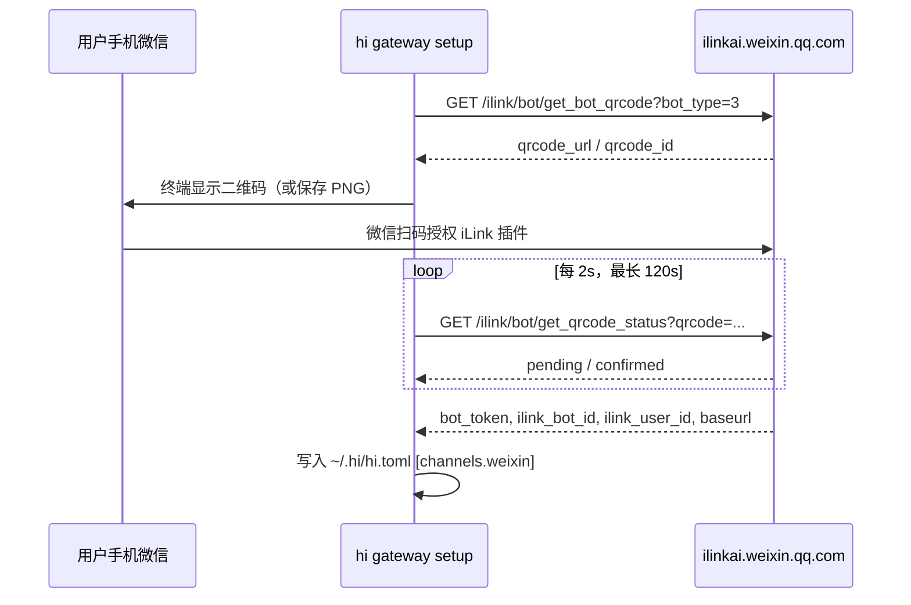
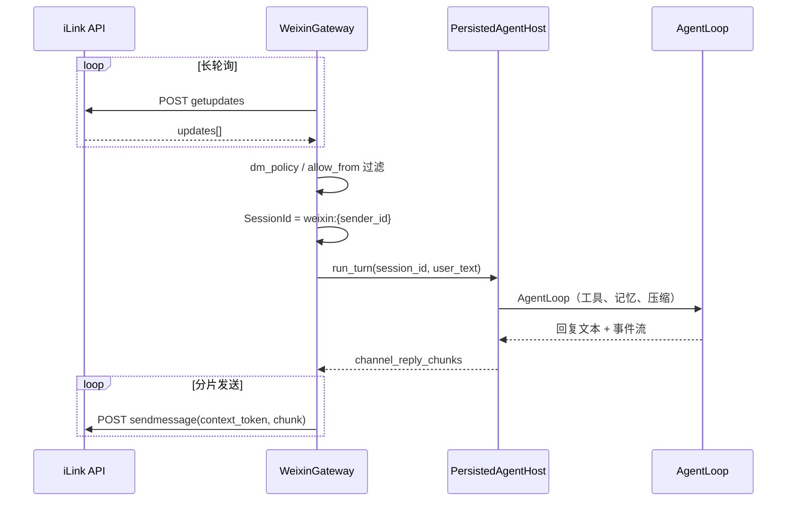

# 个人微信 iLink Gateway 设计

> **状态**：proposed（M8 实施方案） — §8 实施清单以 [m8-weixin-ilink-gateway.md](../exec-plans/active/m8-weixin-ilink-gateway.md) 进度为准  
> **作者**：gz  
> **日期**：2026-06-09  
> **关联**：[m8-weixin-ilink-gateway.md](../exec-plans/active/m8-weixin-ilink-gateway.md)、[2026-05-22-hi-agent-design.md](2026-05-22-hi-agent-design.md)、[core-beliefs.md](../design-docs/core-beliefs.md)

## 1. 概述

### 1.1 背景

hi 的消息渠道 Gateway 已接入 **企业微信**（WebSocket 长连接）与 **飞书**（WebSocket 长连接），均采用**出站连接、无需公网回调**的部署模型。

2026 年 3 月，腾讯通过 **iLink（智联）协议**（`ilinkai.weixin.qq.com`）为个人微信提供**官方、合法**的 Bot HTTP API。任何能发 HTTP 请求的程序均可对接——**hi 可直接实现**。

原设计文档将「个人微信（无官方 Bot API）」列为 MVP 非目标；该前提已变化，本文定义 hi 接入 iLink 的完整方案。

### 1.2 目标

| 目标 | 说明 |
|------|------|
| 直连 iLink | `hi gateway` 通过 HTTP 长轮询收发个人微信消息 |
| 架构一致 | 复用 `ChannelAdapter` + `PersistedAgentHost`，与企微/飞书同进程多 endpoint |
| 本机部署 | 出站 HTTPS，无需公网 IP / ngrok / 回调 URL |
| 会话隔离 | `weixin:{sender_id}` 独立会话，与 `tui:main` / `wecom:*` 互不共享 |
| 安全默认 | `dm_policy = allowlist`，凭证存 `~/.hi/hi.toml`（权限 600） |
| 可预检 | `hi gateway --check` 验证 token 有效性与网络连通 |

### 1.3 非目标（M8 首版）

- 不做群聊（协议有 `group_id` 字段，但公开能力未稳定；留 Phase 2）
- 不做图片/文件/语音/视频（留 Phase 2；MVP 仅文本）
- 不做电脑版微信（iLink 插件仅手机端）
- 不保证生产 SLA（灰度功能，条款允许腾讯随时调整）
- 不做斜杠命令（iLink 不支持）

### 1.4 产品定位

个人微信 iLink 定位为 **实验性渠道**，面向「已灰度到 iLink 插件、希望用个人号私聊 hi」的用户。团队/企业场景继续以 **企微** 为主力。

---

## 2. 外部依赖：iLink 协议摘要

> 协议细节以腾讯后续正式文档为准；当前基于社区逆向与实测整理，实现时需封装为可替换的 `IlinkClient` 层。

### 2.1 接入域名

| 项 | 值 |
|----|-----|
| 默认 Base URL | `https://ilinkai.weixin.qq.com` |
| 协议 | HTTP/JSON |
| 通信模式 | 长轮询（`getupdates`），非 WebSocket |

### 2.2 登录流程（一次性 / token 失效后重登）



登录成功后，后续请求携带：

```
AuthorizationType: ilink_bot_token
Authorization: Bearer <bot_token>
X-WECHAT-UIN: <base64(random uint32 decimal string)>
Content-Type: application/json
```

`baseurl` 由登录响应下发，覆盖默认域名时使用。

### 2.3 核心端点

| 端点 | 方法 | 用途 |
|------|------|------|
| `/ilink/bot/get_bot_qrcode` | GET | 获取登录二维码 |
| `/ilink/bot/get_qrcode_status` | GET | 轮询扫码状态 |
| `/ilink/bot/getupdates` | POST | **长轮询收消息** |
| `/ilink/bot/sendmessage` | POST | 发送消息（需 `context_token`） |
| `/ilink/bot/getconfig` | POST | 获取 typing_ticket（可选） |
| `/ilink/bot/sendtyping` | POST | 「正在输入」状态（可选） |

MVP 仅需前四个；typing 可在 Phase 1.1 加入以改善体验。

### 2.4 消息与回复

**收消息（getupdates）**：长轮询返回 `updates[]`，每条含：

- `sender_id` / `ilink_user_id`：发件人标识
- `context_token`：**回复时必须原样带回**（24 小时有效）
- `msg_type`：1=文本，2=图片，3=语音，4=文件，5=视频
- `text_item.text`：文本内容（msg_type=1）

**发消息（sendmessage）**：

```json
{
  "context_token": "<来自收消息的 context_token>",
  "msg_items": [
    { "msg_type": 1, "text_item": { "text": "回复内容" } }
  ],
  "base_info": { "channel_version": "1.0.2" }
}
```

### 2.5 平台限制（设计必须遵守）

| 限制 | 对 hi 的影响 |
|------|-------------|
| 24 小时 `context_token` 窗口 | 超时后无法主动回复；用户须再发消息才能续期 |
| 一微信用户 ↔ 一 Bot 实例 | 不支持同一微信号绑多个 hi gateway |
| 灰度放量 | 无插件入口则无法使用；向导需明确提示 |
| 仅手机端 | 无法在 PC 微信上测试 iLink |
| 内容安全审核 | 违规回复可能被拦截；hi 不做额外过滤，依赖腾讯侧 |
| 腾讯可随时终止/限流 | 日志标注 `experimental`，文档写清风险 |

---

## 3. hi 架构集成

### 3.1 分层与依赖

```
hi (app/)           gateway setup 向导、二维码展示
    ↓
hi-gateway          WeixinAdapter + IlinkGateway（HTTP 长轮询）
    ↓
hi-core             WeixinConfig、Channel::Weixin、SessionId、ChannelsConfig
```

**约束**（与 LAYERS.md 一致）：

- iLink HTTP 客户端只在 `hi-gateway`
- 配置类型 `WeixinConfig` 在 `hi-core`
- `hi-core` 不依赖 `reqwest`（已有：LLM 在 `hi-ai`）

### 3.2 进程模型

与企微/飞书相同：`hi gateway` 单进程内为每个已启用 endpoint 起一个 `tokio::spawn` 任务。

```
hi gateway
├── wecom adapter     → WebSocket
├── feishu adapter    → WebSocket
└── weixin adapter    → HTTP long-poll loop（新增）
```

### 3.3 ChannelAdapter 实现

```rust
// gateway/src/weixin/adapter.rs（拟）
pub struct WeixinAdapter { /* endpoint_id, account, config, host, workdir */ }

#[async_trait]
impl ChannelAdapter for WeixinAdapter {
    fn name(&self) -> &str { &self.endpoint_id }
    async fn check(&self) -> Result<()> { /* getconfig 或轻量 getupdates */ }
    async fn run(&self) -> Result<()> { /* 长轮询主循环 */ }
}
```

`build_adapter` 扩展：

```rust
ChannelEndpointKind::Weixin { account, config } => {
    Ok(Box::new(WeixinAdapter::new(...)))
}
```

### 3.4 消息处理主路径



与企微/飞书对齐的关键点：

- 复用 `default_turn_concurrency()` 信号量限制并发 Agent 回合
- 复用 `channel_reply_chunks` 按字节分片（个人微信文本长度上限待实测，默认沿用 `DEFAULT_CHANNEL_CHUNK_BYTES`）
- 复用 `ApprovalHandler` 路径（危险命令确认）：MVP 可先 **仅日志提示**，Phase 1.1 用文本消息回传确认（iLink 无交互式按钮）

### 3.5 会话模型

| 配置段 | endpoint id | SessionId | 说明 |
|--------|-------------|-----------|------|
| `[channels.weixin]` | `weixin` | `weixin:{sender_id}` | 默认账户 |
| `[channels.weixin.alt]` | `weixin:alt` | `weixin:alt:{sender_id}` | 多账户（少见；一微信号仅一 Bot） |

`sender_id` 取自 iLink update 中的用户标识字段（实现时以实测为准，优先 `ilink_user_id`，回退 `sender_id`）。

**记忆 owner**（`core/src/memory/owner.rs`）：

```rust
if session_id.0.starts_with("wecom:")
    || session_id.0.starts_with("feishu:")
    || session_id.0.starts_with("weixin:")
{
    OwnerId(session_id.0.clone())
}
```

与企微/飞书一致：渠道会话按用户隔离记忆，不与 `tui:main` 共享。

### 3.6 context_token 管理

`context_token` 是对话级短期凭证，**不能持久化到 SQLite 作为长期状态**；仅在内存中维护：

```rust
// gateway/src/weixin/context.rs（拟）
struct ConversationContext {
    context_token: String,
    updated_at: Instant,
}

type ContextMap = Arc<Mutex<HashMap<String, ConversationContext>>>; // key = sender_id
```

规则：

1. 每次 `getupdates` 收到消息，更新该 `sender_id` 的 token
2. 回复时使用最新 token；发送失败且错误码暗示 token 过期 → 记录 warn，**不**自动重试（等用户再发消息）
3. token 超过 20h 未更新 → 打 debug 日志（便于排查 24h 窗口）

---

## 4. 配置设计

### 4.1 `WeixinConfig`（`core/src/config/weixin.rs`）

```toml
[channels.weixin]
# 登录后自动写入（hi gateway setup）
bot_token = "..."              # 敏感，hi config 脱敏显示
ilink_bot_id = "..."
ilink_user_id = "..."          # 绑定的微信用户（Bot 本体）
base_url = "https://ilinkai.weixin.qq.com"  # 可选，登录响应可覆盖

# 消息游标（自动维护，一般无需手改）
updates_buf = ""

# 访问控制（与 wecom/feishu 一致）
dm_policy = "allowlist"        # allowlist | open
allow_from = ["wxid_xxx"]      # 允许对话的联系人 sender_id

# 可选
welcome_message = "你好，我是 hi"
bot_type = 3                   # iLink 登录参数，默认 3
poll_timeout_secs = 30         # getupdates 长轮询超时
enabled = true
```

```rust
/// 个人微信（iLink） / iLink（`~/.hi/hi.toml` 的 `[channels.weixin]` 段）。
pub struct WeixinConfig {
    pub enabled: bool,
    pub bot_token: String,
    pub ilink_bot_id: String,
    pub ilink_user_id: String,
    pub base_url: Option<String>,
    pub updates_buf: String,
    pub dm_policy: String,
    pub allow_from: Vec<String>,
    pub welcome_message: Option<String>,
    pub bot_type: u32,
    pub poll_timeout_secs: u32,
}
```

方法（对齐 `WeComConfig` / `FeishuConfig`）：

- `base_url()` → 默认 `https://ilinkai.weixin.qq.com`
- `allows_user(sender_id)` → dm_policy 判断
- `validate_dm_access()` → allowlist 非空校验
- `is_empty()` → `bot_token` 为空
- `welcome_message()` → 默认欢迎语

### 4.2 `ChannelsConfig` 扩展

- `weixin_accounts: BTreeMap<String, WeixinConfig>`
- `set_weixin_account` / `weixin_account` / `enabled_endpoints` 纳入 weixin
- TOML 解析：`WEXIN_SCALAR_KEYS` + `parse_weixin_accounts`
- `redacted()`：脱敏 `bot_token`
- `save()`：写入 `[channels.weixin]`

### 4.3 `ChannelEndpoint` 扩展

```rust
pub enum ChannelEndpointKind {
    WeCom { ... },
    Feishu { ... },
    Weixin { account: String, config: WeixinConfig },
}
```

### 4.4 `Channel` 枚举扩展

```rust
pub enum Channel {
    Tui, Chat, Wecom, Feishu, Weixin,
}

pub fn weixin_user(sender_id: &str) -> SessionId { ... }
pub fn weixin_account_user(account: &str, sender_id: &str) -> SessionId { ... }
```

### 4.5 渠道目录（`gateway_channel.rs`）

```rust
GatewayChannelKind {
    id: "weixin",
    label: "个人微信（iLink）",
    hint: "iLink 长轮询 · 实验性 · 需手机插件灰度",
    available: true,  // 实现完成后启用
},
```

---

## 5. Gateway 实现细节

### 5.1 模块结构

```
gateway/src/weixin/
├── mod.rs
├── adapter.rs       # ChannelAdapter
├── ilink.rs         # IlinkClient：HTTP 封装、认证头、错误码
├── gateway.rs       # 长轮询主循环、dispatch update
└── context.rs       # context_token 内存表
```

### 5.2 `IlinkClient`

职责单一：所有 iLink HTTP 调用。

```rust
pub struct IlinkClient {
    http: reqwest::Client,
    base_url: String,
    bot_token: String,
}

impl IlinkClient {
    pub async fn get_bot_qrcode(&self, bot_type: u32) -> Result<QrCode>;
    pub async fn get_qrcode_status(&self, qrcode: &str) -> Result<QrStatus>;
    pub async fn get_updates(&self, buf: &str, timeout_secs: u32) -> Result<UpdatesResponse>;
    pub async fn send_text(&self, context_token: &str, text: &str) -> Result<()>;
    pub async fn get_config(&self) -> Result<BotConfig>;  // check 用
}
```

错误处理：

- HTTP 4xx/5xx → `Error::Message` 含 endpoint 与修复指引
- iLink 业务错误码 → 映射为可读中文（参考企微 `errcode` 处理）
- 网络超时 → 长轮询正常返回空 updates，继续下一轮

### 5.3 长轮询主循环

```rust
async fn run_poll_loop(client: IlinkClient, ctx: WeixinContext, ...) -> Result<()> {
    let mut buf = ctx.config.updates_buf.clone();
    loop {
        match client.get_updates(&buf, ctx.config.poll_timeout_secs).await {
            Ok(resp) => {
                buf = resp.next_buf;
                persist_updates_buf(&ctx, &buf).await?;  // 写回 hi.toml 或内存+定期落盘
                for update in resp.updates {
                    spawn_handle_update(update, ...);
                }
            }
            Err(e) if e.is_auth_error() => {
                return Err(Error::Message(
                    "weixin bot_token 失效：请重新运行 `hi gateway setup` 扫码登录".into()
                ));
            }
            Err(e) => {
                warn!(error = %e, "weixin getupdates failed, retry in 5s");
                tokio::time::sleep(Duration::from_secs(5)).await;
            }
        }
    }
}
```

**`updates_buf` 持久化**：游标丢失会导致重复投递或漏消息。策略：

- 每次成功 `getupdates` 后更新内存；
- 每 30s 或进程退出时 `ChannelsConfig::save()` 写回 `hi.toml`（仅 `updates_buf` 字段）；
- 实现时注意避免并发写整份 config 的竞态（复用现有 save 路径，或单独 `~/.hi/weixin-state.json`）。

推荐 **单独状态文件** `~/.hi/data/weixin-{endpoint_id}.json`，避免频繁重写 `hi.toml`：

```json
{ "updates_buf": "...", "saved_at": "2026-06-09T10:00:00Z" }
```

### 5.4 欢迎语

首条消息或新联系人首次对话时发送 `welcome_message`（与企微 `enter_chat` 类似）：

- 内存 `HashSet<sender_id>` 记录已欢迎；
- 不持久化到 SQLite（重启后可能重复欢迎，可接受）。

### 5.5 `hi gateway --check`

1. 校验 `bot_token` 非空
2. `POST getconfig` 或超时 5s 的 `getupdates` 探活
3. 打印：`ilink_bot_id`、`ilink_user_id`、base_url（脱敏 token）

---

## 6. CLI 与配置向导

### 6.1 `hi gateway setup` 流程

在现有渠道选择列表中加入「个人微信（iLink）」：

```
请选择消息渠道:
  > 个人微信（iLink）     iLink 长轮询 · 实验性 · 需手机插件灰度
    企业微信智能机器人   WebSocket 长连接 · 已接入
    飞书机器人           长连接 WebSocket · 已接入
```

配置步骤：

1. **风险提示**（必须确认）  
   - 灰度功能，腾讯可随时调整  
   - 建议用小号绑定  
   - 阅读《微信 iLink 功能使用条款》

2. **前置检查说明**  
   - 手机微信 ≥ 8.0.70（iOS）/ 8.0.69（Android）  
   - 「我 → 设置 → 插件」中已启用 iLink

3. **扫码登录**  
   - 调用 `get_bot_qrcode`  
   - 终端用 `ratatui` 或 `qrcode` crate 渲染二维码；备选：保存 `~/.hi/weixin-qr.png` 并提示路径  
   - 轮询 `get_qrcode_status`，成功后写入 config

4. **allow_from**  
   - 默认 `dm_policy = allowlist`  
   - 提示：先给 Bot 微信号发一条消息，从 `RUST_LOG=debug` 日志中抄 `sender_id`  
   - 或向导提供「暂时 open，联调后再改 allowlist」选项（带 warn）

5. **保存** → `channels.save()`

### 6.2 `hi config` 展示

```
[channels.weixin]
bot_token = "wx***...***"
ilink_user_id = "xxx@im.weixin"
dm_policy = "allowlist"
allow_from = ["wxid_abc"]
```

---

## 7. 安全与合规

| 项 | 措施 |
|----|------|
| 凭证存储 | `bot_token` 仅存 `~/.hi/hi.toml`，权限 600；不出现在日志 |
| 访问控制 | 默认 `allowlist`；`open` 仅联调 |
| 条款 | 文档引用《微信 iLink 功能使用条款》；向导强制阅读摘要 |
| 账号建议 | 文档建议专用小号，不用主号 |
| 审计 | `tracing` 记录 sender_id、endpoint、回合耗时；不记录消息正文（debug 级可选） |
| 内容 | hi 不额外审查；腾讯侧审核拦截时记录 warn |
| 实验标注 | 启动时 `warn!("weixin channel is experimental (iLink gray release)")` |

---

## 8. 分阶段交付

### Phase 1 — MVP（M8 核心）

- [ ] `WeixinConfig` + `ChannelsConfig` + `ChannelEndpoint`
- [ ] `IlinkClient`：登录、getupdates、sendmessage（文本）
- [ ] `WeixinAdapter` + 长轮询主循环
- [ ] `hi gateway setup` 扫码向导
- [ ] `hi gateway --check`
- [ ] `dm_policy` / `allow_from`
- [ ] 联调文档 `docs/guides/weixin-ilink-integration.md`
- [ ] 架构测试：确认 `hi-gateway` 不反向依赖 `hi`

### Phase 1.1 — 体验增强

- [ ] `sendtyping` 正在输入
- [ ] `updates_buf` 状态文件 + 优雅重启不丢游标
- [ ] 危险命令确认：文本回复「回复 确认 / 取消」
- [ ] 更完善的 iLink 错误码表

### Phase 2 — 多媒体与群聊

- [ ] 图片/文件收发（`getuploadurl` + AES-128-ECB + CDN）
- [ ] 群聊 `group_id`（以腾讯正式能力为准）
- [ ] 语音/视频（低优先级）

---

## 9. 测试与验证

### 9.1 单元测试（`hi-core`）

- `WeixinConfig::allows_user` / `validate_dm_access`
- `ChannelsConfig` 解析/保存 `[channels.weixin]`
- `Channel::weixin_account_user` SessionId 格式

### 9.2 单元测试（`hi-gateway`）

- `IlinkClient` 请求头构造（mock `reqwest` 或 `wiremock`）
- `channel_reply_chunks` 分片后多次 `sendmessage` 调用顺序

### 9.3 集成 / 手工

```sh
hi setup
hi gateway setup          # 选择个人微信，扫码
hi gateway --check
RUST_LOG=info,hi_gateway=debug hi gateway
# 手机微信给 Bot 发消息，观察回复与 sessions.db
hi session show --session weixin:<sender_id>
```

### 9.4 一致性检查

```sh
cargo test --workspace
cargo clippy --workspace -- -D warnings
./scripts/check-consistency.sh
```

---

## 10. 风险与对策

| 风险 | 概率 | 对策 |
|------|------|------|
| 用户未灰度到 iLink | 高 | 向导前置说明 + 官方插件检查指引 |
| 协议变更 | 中 | `IlinkClient` 隔离；版本号 `channel_version` 可配置 |
| token 失效 | 中 | 明确错误提示 + 重新 `gateway setup` |
| 24h 窗口导致「发不出去」 | 中 | 文档说明；日志标注 token 过期 |
| 封号/限流 | 低 | 小号建议；不做群发、不做主动推送 |
| `updates_buf` 丢失重复处理 | 低 | 状态文件 + Agent 幂等（同文重复回合可接受） |

---

## 11. 开放问题

| # | 问题 | 决策时机 |
|---|------|----------|
| 1 | `sender_id` 字段以哪个为准 | 首次联调实测后固化 |
| 2 | 文本单条长度上限 | 实测后调整 `DEFAULT_CHANNEL_CHUNK_BYTES` |
| 3 | 是否支持 `[channels]` 级 `enabled = ["weixin"]` 显式列表 | 可复用企微 legacy 逻辑，M8 可暂缓 |
| 4 | 腾讯正式发布开发者文档后是否替换逆向字段名 | `IlinkClient` 层一次切换 |
| 5 | 群聊是否在 Phase 2 启用 | 视灰度能力与条款更新 |

---

## 12. 文档与元数据更新

实现完成后同步：

| 文件 | 变更 |
|------|------|
| `docs/design/2026-05-22-hi-agent-design.md` | 非目标改为「个人微信（M8 iLink 实验性接入）」 |
| `docs/guides/commands-inventory.md` | 补充 weixin 相关命令 |
| `docs/guides/install.md` | Gateway 渠道列表 |
| `AGENTS.md` | 渠道地图增加个人微信 |
| `ARCHITECTURE.md` | 渠道表增加 weixin |

---

## 附录 A：配置示例（完整）

```toml
[ai]
provider = "openai-compat"
model = "gpt-4o"
api_key = "..."

[workspace]
path = "/Users/me/projects"

[channels.weixin]
bot_token = "ilink_xxx"
ilink_bot_id = "bot_xxx"
ilink_user_id = "user_xxx@im.weixin"
dm_policy = "allowlist"
allow_from = ["wxid_friend1", "wxid_friend2"]
welcome_message = "你好，我是 hi 个人助手（实验性）"
poll_timeout_secs = 30
```
