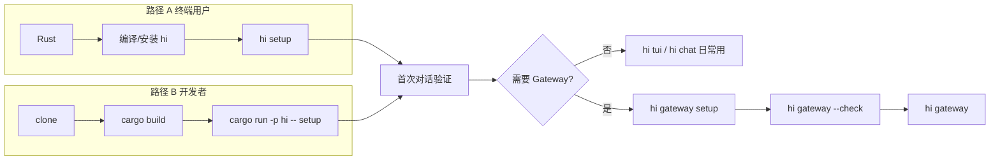

# hi 安装与引导流程（待审核）

> 状态：**草案** — 梳理「从零到能用」的完整路径；`install.md` 已按 §11 草案更新（2026-06-05），向导代码与 §12 待决项未改。  
> 最后更新：2026-06-05  
> 相关：`install.md` · `setup.md` · `commands-inventory.md` · `wecom-gateway-integration.md`

---

## 1. 两条用户路径

| 路径 | 谁 | 目标 | 主文档 |
|------|-----|------|--------|
| **A. 终端用户** | 装好就用 | Rust → 编译/安装 → 配模型 → 聊天 | [install.md](install.md) |
| **B. 仓库开发者** | clone 后改代码 | `cargo build` → 向导 → 自测 | [setup.md](setup.md) |

两条路径在 **第 3 阶段（配置）之后汇合**：共用 `~/.hi/hi.toml`、同一套向导、同一 Agent 核心。



---

## 2. 阶段总览

| 阶段 | 名称 | 必须？ | 成功标志 |
|------|------|:------:|----------|
| 0 | 环境依赖 | ✓ | `cargo --version` 有输出 |
| 1 | 获取二进制 | ✓ | `hi --help` 或 `cargo run -p hi -- --help` |
| 2 | 基础配置 | ✓ | `~/.hi/hi.toml` 存在且含有效 `[ai]` |
| 3 | 首次对话 | ✓ | `hi chat 你好` 有正常回复 |
| 4 | 消息渠道 | ✗ | 远程渠道发消息有回复（可选） |
| 5 | 深度自测 | ✗ | [local-test-checklist.md](local-test-checklist.md) 打勾 |

**最小可用（MVP）**：完成阶段 0～3。  
**Gateway 可用**：额外完成阶段 4。

---

## 3. 阶段 0：环境依赖

### 3.1 硬性要求

| 依赖 | 必须 | 说明 |
|------|:----:|------|
| macOS / Linux | ✓ | 当前主要开发与测试平台 |
| Rust 2021 + cargo | ✓ | 编译 hi |
| 大模型能力 | ✓ | API Key（OpenAI 兼容 / Anthropic）或本机 Ollama |
| 企业微信 / 飞书 / 个人微信后台 | ✗ | 仅 `hi gateway` 需要 |

### 3.2 检查命令

```bash
cargo --version
rustc --version
```

无 cargo → [rustup.rs](https://rustup.rs) 安装，安装后 `source "$HOME/.cargo/env"`。

### 3.3 文档问题（待审核）

| 项 | 现状 | 建议 |
|----|------|------|
| `install.md` 硬编码路径 | `/Users/gz/projects/hi`、代理 `127.0.0.1:56982` | 改为占位符「你的 clone 路径」「按需设置代理」 |
| Windows | 未覆盖 | 明确「暂不支持」或补 WSL 说明 |

---

## 4. 阶段 1：获取二进制

### 4.1 两种方式

| 方式 | 命令 | 适用 |
|------|------|------|
| **安装到 PATH**（推荐日常） | `cargo install --path app` | 终端用户 |
| **不安装** | `cargo run -p hi -- <子命令>` | 开发调试 |

验证：

```bash
which hi          # 安装方式
hi --help         # 应含 setup / tui / chat / gateway / config / session / memory
```

或：

```bash
cargo run -p hi -- --help
```

### 4.2 编译

```bash
cd /path/to/hi
cargo build -p hi          # 仅编译
cargo install --path app   # 编译并安装到 ~/.cargo/bin
```

首次编译需拉 crates.io 依赖，需网络（国内可能需要代理）。

---

## 5. 阶段 2：基础配置（核心引导）

### 5.1 入口命令

```bash
hi setup
# 开发者：cargo run -p hi -- setup
```

**前置**：无（首次运行会自动创建 `~/.hi/` 目录）。  
**重复运行**：标题变为「hi · 更新基础配置」，以当前 `hi.toml` 为默认值。

### 5.2 写入位置与文件

| 路径 | 用途 | 如何产生 |
|------|------|----------|
| `~/.hi/hi.toml` | 统一配置（LLM + workspace + context + memory + channels） | 向导 / 手改 |
| `~/.hi/data/sessions.db` | 会话 transcript（WAL） | 首次对话时自动创建 |
| `~/.hi/logs/` | gateway 等日志 | gateway 运行时 |
| `~/.hi/workspace/` | Gateway 默认工作目录（可向导修改） | 向导 `create_dir_all` |

环境变量覆盖配置路径：`HI_TOML` 或 `HI_CONFIG`。

### 5.3 `hi setup` 向导逐步（代码为准）

源码：`app/src/config/setup.rs` · UI 框架：cliclack（**箭头选择，不是输入数字**）

| 步序 | 界面标题 / 提示 | 字段 | 默认值 / 预设 | 写入 hi.toml |
|:----:|-----------------|------|---------------|--------------|
| 0 | **hi · 基础配置向导**（或「更新基础配置」） | — | — | — |
| 1 | **配置说明** | — | 说明路径、可重复运行、memory 默认开、密钥勿提交 Git | — |
| 2 | **当前配置摘要**（仅更新时） | — | Provider / model / workspace / API Key 是否已设置 | — |
| 3 | **工作目录说明** | — | 强调：此项仅 Gateway；tui/chat 用**当前 shell 目录** | — |
| 4 | `Gateway 工作目录（workspace）` | `workspace` | `~/.hi/workspace`（`Config::default`） | ✓ |
| 5 | `请选择大模型 Provider` | `ai.provider` | 五选一，见下表 | ✓ |
| 6a | `Ollama 服务地址（不含 /v1 后缀）` | `ai.base_url` | `http://localhost:11434` | ✓（仅 ollama） |
| 6b | `API 基础地址 base_url（留空则使用 Provider 默认值）` | `ai.base_url` | 见 Provider 预设 | ✓（openai-compat / anthropic） |
| 6c | DeepSeek API Key 说明 | — | 引导至 platform.deepseek.com | —（仅 deepseek） |
| 7 | `API Key`（密码输入；更新时空回车保留） | `ai.api_key` | — | ✓（Ollama 跳过） |
| 8 | `选择模型` 或 `模型名称（model）` | `ai.model` | 先按 base_url+key 动态拉取，失败回退菜单/手输 | ✓ |
| 9 | 保存 spinner → **完成** | — | 见下方 FINISH 文案 | — |

> 顺序说明：API Key 提前到选模型之前，因为动态拉取模型列表需要 base_url + key。

**Provider 预设**（`setup.rs` `PRESETS`）：

| 选项 label | instance / default | adapter | 默认 model | 默认 base_url |
|------------|-------------------|---------|------------|---------------|
| DeepSeek | `deepseek` | `openai-compat` | `deepseek-v4-flash` | `https://api.deepseek.com` |
| OpenAI 兼容接口 | `openai-compat` | `openai-compat` | `gpt-4o` | （空，用户填写） |
| OpenAI Codex | `codex` | `codex` | 本地 Codex 模型列表 | ChatGPT 后端 |
| Anthropic Claude | `anthropic` | `anthropic` | `claude-sonnet-4-20250514` | （空，走 Anthropic 默认） |
| Ollama 本地推理 | `ollama` | `ollama` | `llama3.2` | `http://localhost:11434` |

**模型选择**（`setup.rs` `choose_model_with_fetch`）：
- **openai-compat / anthropic / ollama**（含 DeepSeek、自定义厂商）：用已填的 base_url（+ API Key）**动态拉取**真实模型列表（`hi-ai::model_listing`：openai-compat `GET {base}/models`、anthropic `GET {base}/v1/models`、ollama `GET {base}/api/tags`），菜单展示真实 id +「自定义模型名…」+「返回」。拉取失败（网络/鉴权/解析）则给出回退提示，退回内置 curated 列表 / 手动输入。
- **codex**：读取本地 Codex CLI 的 `~/.codex/config.toml` + `models_cache.json`（Codex CLI 自身刷新写入），叠加内置兜底；ChatGPT 后端无公开列模型端点，故沿用本地缓存这一「准动态」来源。- **ollama**：用 base_url **动态拉取**本地已安装模型（`GET {base}/api/tags`，无需鉴权，字段 `models[].name`）；拉取失败回退内置 curated 列表 / 手动输入。

**向导不配置、但保留默认的段**（重复 `hi setup` 不覆盖用户手改）：

- `[context]` — 默认 enabled，128K 窗口 + 自动压缩；高级项手改 hi.toml
- `[memory]` — 默认 enabled，结绳记忆 + 回合后抽取
- `[tools.approvals]` — 统一审批策略（bash + 文件工具）
- `[logging]`
- `[channels.*]` — 需另跑 `hi gateway setup`（wecom / feishu / weixin）

**完成页（FINISH）文案**：

```text
基础配置已保存。

后续步骤：
  hi chat 你好     命令行试聊
  hi                    启动本地 TUI
  hi gateway setup     配置消息渠道（可选）
  hi config        查看配置（密钥脱敏）
```

### 5.4 手动配置（绕过向导）

```bash
mkdir -p ~/.hi
cp hi.example.toml ~/.hi/hi.toml
# 编辑 [ai.providers.<name>] 等
```

### 5.5 配置校验

```bash
hi config    # JSON 输出，api_key 脱敏为 ***
```

无配置或缺 API Key 时，启动 tui/chat/gateway 会报错：

```text
missing LLM api_key in ~/.hi/hi.toml — 在 [ai.providers.<name>] 填写或运行 `hi setup`
```

（Ollama 除外，provider=`ollama` 时不要求 api_key。）

### 5.6 文档 vs 代码差异（待审核）

| 话题 | install.md | 代码 / 实际 |
|------|------------|-------------|
| workspace 建议值 | `~/hi-test-workspace` | 向导默认 `~/.hi/workspace` |
| setup 是否提 memory | 未写 | 向导 note 会提 memory 默认开 |
| context 新字段 | 未写 | `tool_output_max_chars` / `trim_keep_chars` 有默认，向导未暴露 |
| 工作目录说明 | 「Gateway 专用」 | 与代码 note 一致 ✓ |

---

## 6. 阶段 3：首次对话验证

### 6.1 推荐验证命令

```bash
hi chat 你好，回复 OK
```

有正常文字回复 → **安装 + 基础配置 OK**。

### 6.2 其它入口（等价 Agent，不同 session）

| 命令 | session_id | 工作目录 |
|------|------------|----------|
| `hi` / `hi tui` | `tui:main` | 命令执行时的 **cwd** |
| `hi chat` | `chat:main` | 同上 |
| `hi chat …` | `chat:main` | 同上 |

tui 与 chat **不共享**同一会话 transcript。

### 6.3 首次运行自动创建

- `~/.hi/data/sessions.db` — 首次 `run_turn` 持久化时
- 无需用户手动建库

### 6.4 装好之后常用下一步

| 目标 | 命令 |
|------|------|
| 命令行多轮 | `hi chat` |
| 终端 UI | `hi` 或 `hi tui` |
| 看配置 | `hi config` |
| 看会话 | `hi session list` / `hi session show --context` |
| 清空 Agent 上下文 | 对话内 `/reset` 或 `hi session purge --confirm`（见 commands-inventory.md） |

---

## 7. 阶段 4：消息渠道（可选）

### 7.1 前置

- 阶段 2 已完成（`~/.hi/hi.toml` 存在）
- 对应渠道后台已就绪（企微：智能机器人 + 长连接；飞书：自建应用 + 长连接；微信：iLink 插件）

### 7.2 入口

```bash
hi gateway setup
```

若未 `hi setup`，直接报错：

```text
请先完成基础配置：
  hi setup
```

### 7.3 `hi gateway setup` 向导逐步（代码为准）

源码：`app/src/config/gateway.rs`

| 步序 | 界面 | 内容 |
|:----:|------|------|
| 0 | **hi · 消息渠道配置**（或「更新…」） | — |
| 1 | **配置说明** | 写入 hi.toml 的 `[channels.*]` 段；先选平台再填凭证 |
| 2 | `请选择消息渠道` | **企业微信** / **飞书** / **个人微信（iLink）** |
| 3+ | 各渠道凭证 | 企微：Bot ID / Secret；飞书：App ID / Secret；微信：终端扫码 |

**完成页（FINISH）**：

```text
消息渠道配置已保存。

后续步骤：
  hi gateway --check    连接预检
  hi gateway            启动网关
  hi config        查看配置（密钥脱敏）
```

### 7.4 Gateway 运行与验证

```bash
hi gateway --check    # 连接 + 订阅，成功则退出
hi gateway            # 常驻（release 默认后台 start，debug 默认前台 run）
```

详细联调：

- 企微：[wecom-gateway-integration.md](wecom-gateway-integration.md)
- 飞书：[feishu-gateway-integration.md](feishu-gateway-integration.md)
- 微信 iLink：[weixin-ilink-integration.md](weixin-ilink-integration.md)

### 7.5 Gateway 与 workspace

- Agent 工具（read/bash 等）在 **`hi.toml` 的 `workspace`** 下执行，不是本机 cwd
- 本地 tui/chat 则在用户 **当前目录** 下执行 — 新手易混淆，引导里应强调

---

## 8. 阶段 5：开发者自测（可选）

```bash
cargo test --workspace
cargo clippy --workspace -- -D warnings
./scripts/check-consistency.sh
```

功能清单：[local-test-checklist.md](local-test-checklist.md)

---

## 9. 无引导 / 缺失环节（待审核）

当前 **没有** 以下能力，新用户可能迷路：

| 缺失 | 现象 | 可选改进 |
|------|------|----------|
| 首次运行 `hi` 无 config | 直接报错退出 | 提示「请先运行 hi setup」并可选跳转向导 |
| 无 `--version` | — | README 未强调 |
| install 与 setup 内容重叠 | 两处维护 | 合并为「用户篇 + 开发者附录」 |
| 向导不配置 memory 细节 | 用户不知道默认开了什么 | `hi setup` 增加一句或链到 memory 文档 |
| 向导不配置 context 新字段 | tool 输出上限等只能手改 toml | 高级项折叠或单独 `hi config advanced` |
| 单路径「一条龙」脚本 | install.md 末尾有，但含硬编码 | 提供 `scripts/bootstrap.sh` 模板 |

---

## 10. 文档地图（安装相关）

| 文件 | 角色 | 审核建议 |
|------|------|----------|
| [README.md](../../README.md) | 入口 4 行快速开始 | 链到本文 + install |
| [install.md](install.md) | 终端用户主流程 | 已按 §11 更新（占位路径、workspace 表、链到本文） |
| [setup.md](setup.md) | 开发者 | 保留，避免重复 install 全文 |
| [hi.example.toml](../../hi.example.toml) | 手配模板 | 与向导默认值对齐 |
| [local-test-checklist.md](local-test-checklist.md) | QA | 与向导步骤编号对齐 |
| [wecom-gateway-integration.md](wecom-gateway-integration.md) | 企微 Gateway 深链 | 保持，install 只链过去 |
| [feishu-gateway-integration.md](feishu-gateway-integration.md) | 飞书 Gateway | 同上 |
| [weixin-ilink-integration.md](weixin-ilink-integration.md) | 个人微信 iLink | 同上 |
| [commands-inventory.md](commands-inventory.md) | 命令全集 | 引导完成后才需要 |

---

## 11. 建议的「对外唯一新手路径」（草案，未实施）

审核后可作为 rewrite install.md 的大纲：

```text
1. 装 Rust（一行链 rustup）
2. cargo install --path app
3. hi setup          ← 唯一必做配置
4. hi chat 你好        ← 验收
5. （可选）hi               ← TUI
6. （可选）hi gateway setup → hi gateway --check → hi gateway
```

**原则草案**：

- [ ] 配置只推 `hi setup` + `hi gateway setup`，不教手改 toml（除非高级用户）
- [ ] workspace 统一默认 `~/.hi/workspace`，文档不再提 `hi-test-workspace`
- [ ] 代理 / 路径全部用占位符
- [ ] Gateway 与本地 CLI 的工作目录差异用一张表说清

---

## 12. 审核记录（你来填）

| 日期 | 决定 | 备注 |
|------|------|------|
| | | |

### 12.1 待决问题清单

- [ ] install.md 是否合并 setup 开发者段落？
- [ ] workspace 默认值：统一 `~/.hi/workspace` 还是继续建议独立测试目录？
- [ ] `hi setup` 是否要增加 memory / context 高级项？
- [ ] 无 config 时 `hi` / `hi tui` 是否自动进入 `hi setup`？
- [ ] 是否需要独立「安装引导」可执行脚本（非文档）？
